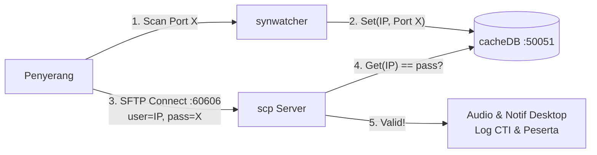

# scp

**SFTP Honeypot Server** yang terintegrasi dengan [synwatcher](https://github.com/n0z0/synwatcher) dan [cacheDB](https://github.com/n0z0/cachedb).

Server ini mendengarkan pada port **`60606`** dan mengimplementasikan mekanisme otentikasi dinamis (*port knocking honeypot*):
- **Username:** Alamat IP penyerang/klien yang melakukan koneksi.
- **Password:** Nomor port **terakhir** yang di-scan oleh IP tersebut (yang ditangkap oleh `synwatcher` dan tersimpan di `cacheDB`).



---

## Mekanisme Honeypot

1. Penyerang men-scan port target menggunakan scanner (seperti `nmap` atau script khusus).
2. `synwatcher` mendeteksi paket SYN/UDP dan mendaftarkan pasangan `IP -> Port` ke `cacheDB`.
3. Penyerang mencoba terhubung ke SFTP Server (`scp`) pada port **`60606`**:
   - Jika username cocok dengan IP klien DAN password cocok dengan port yang tersimpan di `cacheDB`:
     - Otentikasi **berhasil**.
     - Nomor urut peserta dihitung: `Port mod 30 = Nomor Urut`.
     - Memutar audio notifikasi dan memunculkan pop-up desktop.
     - Dicatat ke riwayat peserta masuk (`peserta_masuk.log`).
     - Dicatat ke log terstruktur CTI (`scp_cti.jsonl`).
   - Jika kredensial salah atau IP belum pernah men-scan:
     - Otentikasi ditolak dan dicatat ke log CTI sebagai percobaan akses gagal.

---

## Cyber Threat Intelligence (CTI) Logging

Setiap interaksi otentikasi login maupun **aktivitas file di dalam sesi SFTP** (melihat direktori, download, upload, edit, hapus, rename) otomatis dicatat ke file **`scp_cti.jsonl`** dalam format JSON Lines yang siap di-ingest ke SIEM, Elastic, Wazuh, atau MISP/OpenCTI.

Log ini memetakan event ke taktik dan teknik **MITRE ATT&CK**:
- **Login Berhasil:** `Valid Accounts` (`T1078`), Tactic: `Initial Access`.
- **Login Gagal:** `Brute Force: Password Guessing` (`T1110.001`), Tactic: `Credential Access`.
- **Melihat Direktori / Stat:** `File and Directory Discovery` (`T1083`), Tactic: `Discovery`.
- **Upload / Edit File:** `Ingress Tool Transfer / Upload Tools` (`T1105`), Tactic: `Persistence`.
- **Download File:** `Data from Local System` (`T1005`), Tactic: `Exfiltration`.
- **Hapus File / Folder:** `Data Destruction` (`T1485`), Tactic: `Impact`.
- **Rename File / Buat Folder:** `Masquerading` (`T1036`), Tactic: `Defense Evasion`.

---

## 🔬 Asynchronous Metadata Forensics Engine & Concurrency

Ketika penyerang mengunggah file ke honeypot SFTP (`T1105`), `scp` secara otomatis menjalankan analisis forensik metadata secara **asinkron** menggunakan **bounded Goroutine worker pool** (`runtime.NumCPU() * 2` worker, buffered channel 1024):
- **Zero Latency Impact:** Sesi transfer SFTP penyerang selesai secara instan (< 1ms) tanpa menunggu proses forensik selesai.
- **Panic-Safe:** Seluruh parser dilindungi pemulihan (*recover*) otomatis sehingga berkas korup tidak akan menghentikan server.
- **Dukungan Format Forensik:**
  - **Dokumen Word / OpenXML (.docx):** Ekstraksi pembuat (*Author/Creator*), pengubah terakhir (*Last Modified By*), software pembuat (*Application/Word version*), dan stempel waktu UTC.
  - **Dokumen PDF (.pdf):** Ekstraksi Title, Author, Creator, Producer tool, dan waktu modifikasi.
  - **Gambar (JPEG / PNG / EXIF):** Ekstraksi model kamera/smartphone (`Make`, `Model`), software pengedit, dan **koordinat GPS fisik** (`GPSLatitude`, `GPSLongitude`) jika ada.
  - **Executable Windows (PE .exe / .dll):** Ekstraksi path kompilasi debug PDB (*Program Database path*) yang sering membocorkan struktur folder dan username lokal di laptop pengembang malware penyerang!
  - **Hashing:** Perhitungan SHA256 dan MD5 instan untuk lookup Threat Intelligence (VirusTotal / AlienVault OTX).

### Contoh Format Log CTI (`scp_cti.jsonl`)

**1. Percobaan Login Berhasil (Terkorelasi dengan Reconnaissance L4 dari synwatcher & cachedb):**
```json
{
  "timestamp": "2026-10-08T02:08:15.123456789Z",
  "sensor_id": "honeypot-node-1",
  "event_type": "SFTP_LOGIN_SUCCESS",
  "status": "success",
  "client_ip": "192.168.1.150",
  "client_port": 54321,
  "username": "192.168.1.150",
  "password": "8080",
  "client_version": "SSH-2.0-OpenSSH_9.6",
  "participant_number": 20,
  "recon_profile": {
    "syn_hash": "a8f5c389e63470123efb69201a0912cb",
    "risk_score": "90",
    "severity": "CRITICAL",
    "target_service": "RDP",
    "intent_category": "REMOTE_DESKTOP_EXPLOITATION_PROBE",
    "scan_velocity": "BURST_AUTOMATED_SCAN",
    "estimated_os": "Linux / Android / macOS",
    "scanner_tool": "Nmap (Stealth SYN Scan)",
    "scan_hits": "8",
    "last_scan": "2026-10-08T02:08:14.990Z"
  },
  "mitre_attack": {
    "tactic": "Initial Access",
    "technique": "Valid Accounts: Default/Known Accounts",
    "technique_id": "T1078"
  }
}
```

**2. Melihat Isi Direktori (Reconnaissance Pasif):**
```json
{
  "timestamp": "2026-10-08T02:08:18.451234567Z",
  "sensor_id": "honeypot-node-1",
  "event_type": "SFTP_FILE_ACTIVITY",
  "status": "success",
  "client_ip": "192.168.1.150",
  "client_port": 54321,
  "username": "192.168.1.150",
  "client_version": "SSH-2.0-OpenSSH_9.6",
  "participant_number": 20,
  "file_activity": {
    "action": "LIST_DIR",
    "path": "/",
    "size_bytes": 5
  },
  "mitre_attack": {
    "tactic": "Discovery",
    "technique": "File and Directory Discovery",
    "technique_id": "T1083"
  }
}
```

**3. Upload / Menaruh File (Misal Penyerang Menaruh Payload):**
```json
{
  "timestamp": "2026-10-08T02:08:22.991283123Z",
  "sensor_id": "honeypot-node-1",
  "event_type": "SFTP_FILE_ACTIVITY",
  "status": "success",
  "client_ip": "192.168.1.150",
  "client_port": 54321,
  "username": "192.168.1.150",
  "client_version": "SSH-2.0-OpenSSH_9.6",
  "participant_number": 20,
  "file_activity": {
    "action": "UPLOAD",
    "path": "/flag.txt",
    "size_bytes": 1024
  },
  "mitre_attack": {
    "tactic": "Persistence",
    "technique": "Upload Malware / Tools",
    "technique_id": "T1105"
  }
}
```

**4. Percobaan Login Gagal:**
```json
{
  "timestamp": "2026-10-08T02:08:25.987654321Z",
  "sensor_id": "honeypot-node-1",
  "event_type": "SFTP_AUTH_FAILED",
  "status": "failed",
  "failure_reason": "invalid_password",
  "client_ip": "192.168.1.150",
  "client_port": 54322,
  "username": "192.168.1.150",
  "password": "wrongpassword",
  "client_version": "SSH-2.0-libssh_0.10.4",
  "mitre_attack": {
    "tactic": "Initial Access",
    "technique": "Brute Force: Password Guessing",
    "technique_id": "T1110.001"
  }
}
```

---

## Instalasi & Upgrade Otomatis

### Windows (PowerShell)
Jalankan perintah berikut untuk mengunduh binary rilis terbaru dan otomatis mendaftarkannya ke PATH pengguna:
```powershell
irm https://raw.githubusercontent.com/n0z0/scp/main/install.ps1 | iex
```
*(Bisa dijalankan kapan saja untuk upgrade ke versi terbaru).*

### Linux (Bash)
Jalankan perintah berikut di terminal:
```bash
curl -fsSL https://raw.githubusercontent.com/n0z0/scp/main/install.sh | bash
```
*(Binary otomatis dipasang sebagai `scp-server` ke `/usr/local/bin` atau `~/.local/bin` agar tidak bentrok dengan utilitas openSSH `scp` bawaan Linux).*

---

## Menjalankan Server

### Kebutuhan
1. **[cacheDB](https://github.com/n0z0/cachedb)** aktif di `127.0.0.1:50051`.
2. **[synwatcher](https://github.com/n0z0/synwatcher)** aktif memantau interface jaringan target.

### Menjalankan Langsung
```powershell
# Windows
scp

# Linux
scp-server
```

Server akan otomatis:
- Menghasilkan host key `id_rsa` jika belum ada.
- Membuka port listening SFTP di `0.0.0.0:60606`.
- Mengaktifkan logging CTI ke `scp_cti.jsonl`.

### Menguji Koneksi (Klien)
```powershell
# Contoh dari IP 192.168.1.150 setelah men-scan port 80 pada mesin honeypot:
sftp -P 60606 192.168.1.150@<IP_HONEYPOT>
# Masukkan password: 80
```

---

## Release

Release dibuat otomatis oleh [GitHub Actions](.github/workflows/release.yml) setiap kali ada push ke branch `main`:
- Versi patch dinaikkan secara otomatis dari tag terakhir (misal `v0.1.1` -> `v0.1.2`).
- Binary langsung siap pakai (`scp_windows_amd64.exe` dan `scp_linux_amd64`) serta arsip bundel di-upload langsung ke halaman Releases.

---

## Lisensi
[GNU AGPL v3](LICENSE)
